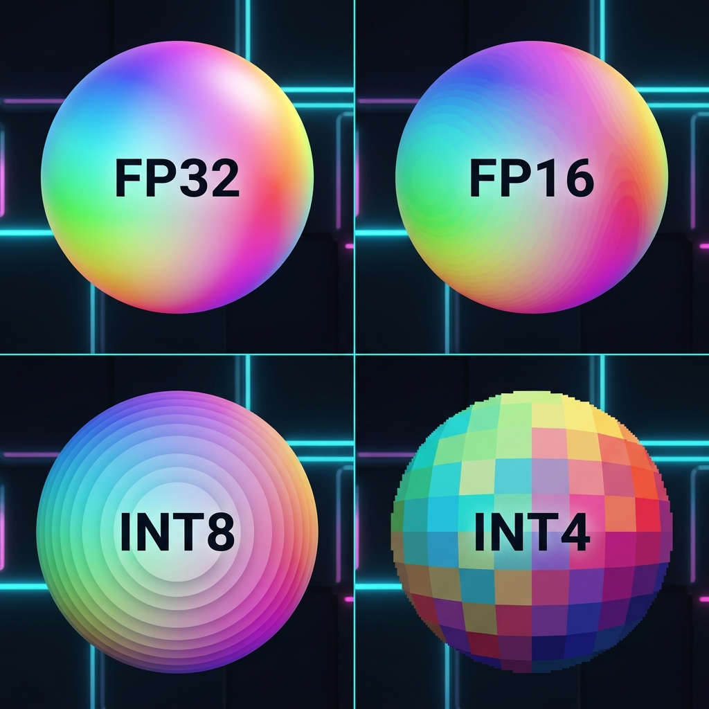
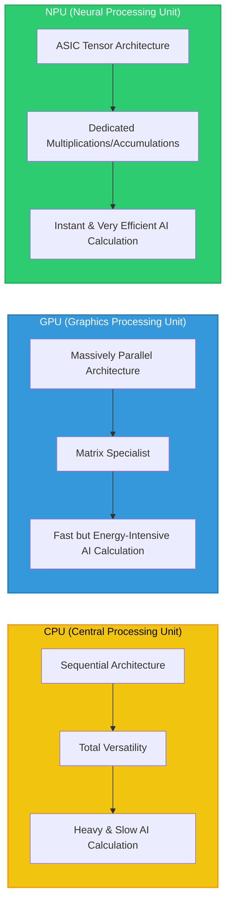
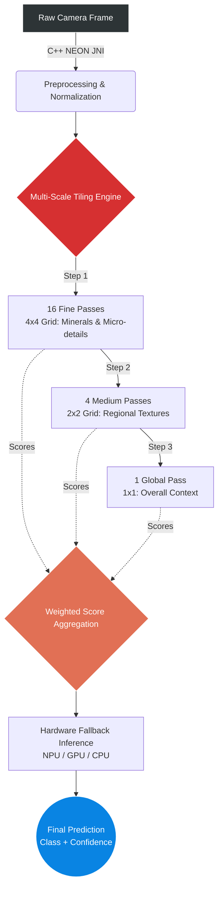

# Lithotheque Edge Models - GeoStratum
**Technical showcase of the Edge AI architecture powering the Lithotheque offline application.**

[](https://www.geostratum.eu/lithotheque)
[](https://www.geostratum.eu/lithotheque)
[](https://ai.google.dev/edge/litert)
[](https://en.cppreference.com/w/cpp/17)
[](https://developer.android.com/ndk)
[](https://www.python.org/downloads/release/python-3110/)
[](https://developer.qualcomm.com/software/qualcomm-ai-engine-direct-sdk)
[](METHODOLOGY.md)
[](METHODOLOGY.md)

> [!IMPORTANT]
> **Note on Artifact Availability & Intellectual Property**
> To protect our proprietary metrology datasets and commercial intellectual property, the compiled `.tflite` and `.onnx` model artifacts, alongside the FP32 source weights, are not publicly distributed in this repository. 
> 
> The core purpose of this scientific repository is to openly share the **engineering methodology**, the **W4A8 Full Integer quantization pipeline**, and the **mathematical architectural strategies** (such as the 21-Pass Multi-Scale Tiling) used to achieve real-time inference on **mobile Edge NPUs (e.g., Qualcomm Hexagon, Google Tensor Edge TPU)**.


## Table of Contents
- [1. Overview](#1-overview)
- [1.1 Understanding Edge AI: Key Concepts](#11-understanding-edge-ai-key-concepts)
- [2. Dual-Model Ecosystem](#2-dual-model-ecosystem)
- [3. Training Data & Acknowledgements](#3-training-data--acknowledgements)
- [4. Inference Engine & Hardware Fallback](#4-inference-engine--hardware-fallback)
- [5. Deployment Strategy (AI Tiers)](#5-deployment-strategy-ai-tiers)
- [6. W4A8 Quantization Methodology](#6-w4a8-quantization-methodology)
- [7. Technical Specifications (I/O)](#7-technical-specifications-io)
- [8. Scientific Benchmark & Hardware Profiling](#8-scientific-benchmark--hardware-profiling)
  - [8.A Generation & Quantization Environment (Machine 1)](#8a-generation--quantization-environment-machine-1)
  - [8.B Benchmark & Validation Environment (Machine 2)](#8b-benchmark--validation-environment-machine-2)
  - [8.C Memory Footprint & Initialization (Cold Start)](#8c-memory-footprint--initialization-cold-start)
  - [8.D Inference Latency & Accuracy](#8d-inference-latency--accuracy)
- [9. Hardware Strategy & Analysis](#9-hardware-strategy--analysis)
- [10. Model Card (Technical Specs)](#10-model-card-technical-specs)
- [11. Deployment & Application](#11-deployment--application)
- [12. Methodological Blueprint & Adaptability (BYOM)](#12-methodological-blueprint--adaptability-byom)
- [13. Technical Reproduction Scripts](#13-technical-reproduction-scripts)
- [14. License](#14-license)
- [15. Contact](#15-contact)
- [16. Citation](#16-citation)

## 1. Overview
This repository documents the advanced Edge AI architecture integrated into [GeoStratum Lithotheque](https://www.geostratum.eu/lithotheque). To provide instant, on-device geological classification and scale detection without requiring an internet connection, the application relies on a highly optimized, dual-model ecosystem deployed via **Google Play Asset Delivery (On-Demand)**.

**[Try the Application on Play Store](https://play.google.com/store/apps/details?id=com.lithotheque.app.release)** | **[Read the Model Card](MODEL_CARD.md)** | **[Quantization Methodology](METHODOLOGY.md)**

## 1.1 Understanding Edge AI: Key Concepts
To understand how Lithotheque identifies rocks instantly on a phone, one must first master four fundamental concepts of AI engineering.

### A. Model Parameters: Weights
An AI model is a mathematical architecture whose predictive capabilities depend on millions of variables called **Weights**.
*   **Architecture** defines the structure of the neural network.
*   **Weights** represent the numerical values optimized during training. They constitute the model's "memory": the inference process consists of propagating input signals (pixels) through this weighted structure to reach a classification.

### B. Numerical Precision (FP32, FP16, INT8, INT4)
In computing, a number can be stored with more or less detail. This is called **Precision**.

| Format | Type | Size | Usage | Why use it? |
| :--- | :--- | :--- | :--- | :--- |
| **FP32** | 32-bit Floating point | 100% | Training on PC | Maximum precision, but very heavy and slow. |
| **FP16 / BF16** | 16-bit Floating point | 50% | GPU Acceleration | Good balance for graphics cards. |
| **INT8** | 8-bit Integer | 25% | Mobile Standard | Very fast, ideal for most smartphones. |
| **INT4** | 4-bit Integer | 12.5% | **Ultra-Performance** | Reduced size, maximum inference throughput, increased energy efficiency. |



### C. Quantization: Precision Optimization
**Quantization** is a compression technique aimed at converting model parameters from a continuous space (32-bit floats) to a discrete space (8 or 4-bit integers).
*   **Problem**: Using high-precision models (FP32) is prohibitive on mobile due to the memory footprint and excessive demand on thermal resources.
*   **Solution**: Reducing numerical precision allows for dividing the model size by up to 8.
*   **Goal**: Maintain predictive integrity despite value discretization. This is the challenge of our W4A8 methodology (4-bit Weights, 8-bit Activations).

### D. Inference: AI in Action
**Inference** is the moment when the model uses what it has learned to analyze a new image. Unlike training, which takes days on servers, mobile inference must occur in milliseconds.

### E. Hardware Architecture: Computing Units
Running a model on a smartphone relies on three types of units with distinct characteristics:
1.  **CPU (Central Processing Unit)**: General-purpose processor managing the OS and application logic. Its versatility limits its efficiency on massive matrix calculations (high latency).
2.  **GPU (Graphics Processing Unit)**: Massively parallel unit optimized for graphics rendering. Efficient for AI but induces significant power consumption.
3.  **NPU (Neural Processing Unit)**: ASIC accelerator specifically dedicated to tensor operations. It offers the best performance/watt ratio and is the priority optimization target for Lithotheque.



### F. Performance Metrics
*   **Latency**: The reaction time. A 20ms latency means the AI responds 50 times per second.
*   **Cold Start**: The time required to load the model into memory at launch. If the model is too heavy, the application feels "frozen" at startup.
*   **TOPS (Tera Operations Per Second)**: The unit of measurement for NPU power. 45 TOPS means 45 trillion operations per second.

### G. Edge AI Glossary
Technical definitions of concepts used in this documentation:
*   **Tensor**: Multidimensional algebraic structure (vector, matrix, or volume) serving as a carrier for data flow within the network.
*   **Gradient**: Vector of partial derivatives representing the descent direction necessary for weight optimization during the learning phase.
*   **Backend (Delegate)**: Hardware abstraction layer driving the execution of calculations on a specific component (NPU, GPU, or CPU).
*   **Overfitting**: State where the model loses its generalization capability by memorizing the statistical specifics of the training set.
*   **Normalization**: Preprocessing operation aligning input data distribution on a standardized numerical domain (e.g., `[-1, 1]`).

---

## 2. Dual-Model Ecosystem
Lithotheque doesn't use one, but two specialized models to ensure maximum fluidity:

### A. VisionAiManager (Lithological Classification)
This model identifies the rock. To ensure no details are missed (like small crystals), we use **Multi-Scale Tiling**:
*   Instead of reducing a giant photo into a small, blurry 256x256 pixel thumbnail, the AI cuts the photo into 21 pieces.
*   It analyzes the overall view, then medium areas, and finally very precise zooms (16 "tiles").
*   It combines these 21 analyses to give an ultra-precise final result.


> **Figure 1: Real-time Rock Detection** - Demonstration of the 21-MST engine classifying lithological samples with high confidence on a Galaxy Z Fold 7 via Remote Test Lab.

### Dataset Categorization (104 classes)
The model is trained on a diverse set of 104 geological structures, categorized below by their primary genetic classification.

#### 1. Sedimentary (Sed)
> Bauxite, Caliche, Chalk, Chert, Clay, Coal, Conglomerate, Coquina, Diatomite, Dolomitic Limestone, Dolomites, Flint, Fossiliferous Limestone, Gypsum, Halite, Limestone, Novaculite, Oolitic Limestone, Phosphate, Potash, Sandstone, Shale (Mudstone), Siliceous Sinter, Siltstone, Sodium Carbonate, Tufa.

#### 2. Magmatic / Plutonic (Mag)
> Anorthosite, Aplite, Diorite, Dolerite, Dunite, Essexite, Gabbro, Granite, Granodiorite, Norite, Pegmatite, Syenite.

#### 3. Volcanic / Extrusive (Volc)
> Andesite, Basalt, Dacite, Ignimbrite, Komatiite, Obsidian, Olivine Basalt, Phonolite, Pillow Lava, Pumice, Rhyolite, Tephrite, Trachyte, Volcanic Tuff, Volcanic Bombs.

#### 4. Metamorphic (Meta)
> Anthracite, Breccia (Tectonic/Fault), Gneiss, Hornfels, Lapis Lazuli, Marble, Phyllite, Quartzite, Schists, Serpentine, Skarn, Slate.

#### 5. Native Elements, Minerals, and Ores
> Bornite, Calcite, Chromite, Cobalt, Columbite-Tantalite, Copper, Feldspar, Fluorite, Gold, Iron Ore, Labradorite, Lead, Lithium, Magnetite, Malachite, Mariposite, Mica, Molybdenum, Nickel, Platinum, Pyrite, Quartz, Silica, Silver, Sodalite, Stibnite, Sulfur, Tantalum, Tungsten, Uranium, Vanadium, Zeolite, Zinc.


---

### B. LocalAiManager (Metrology and Calibration)
* **Objective:** Spatial detection (*Object Detection*) of reference objects (standardized coins, geological scales) to extract bounding boxes and establish a geometric calibration ratio (pixel-to-millimeter).
* **The Resolution Paradox:** Unlike rock classification, which evaluates global texture, metrology requires strict delimitation of geometric contours. The model thus imperatively requires a massive input tensor of **1024x1024 pixels**.
* **Architectural Optimization:** To compensate for the (quadratic) computational cost generated by this resolution 16 times higher than the vision model, the selected network architecture is deliberately minimalist (`MobileNetV4-Small`). This asymmetric coupling (High Input Resolution + Low Graph Depth) ensures sub-millimeter localization acuity while respecting the device's thermal envelope.
* **Training Corpus:** Pre-trained model fine-tuned on over 1,000 calibrated field photographs.

## 3. Data Engineering and Acknowledgments

A neural network's generalization capability (its ability to predict correctly on unseen photographs) is intrinsically linked to topological variance and the quality of its training corpus. The Lithotheque ecosystem leverages a **Transfer Learning** approach, adjusting the weights of foundational vision models to our specialty domains through strict data curation.

### A. Metrology and Spatial Detection (LocalAiManager)
Extracting a geometric calibration ratio requires absolute robustness against field visual noise (occlusions, cast shadows, mud).
* **GeoStratum Proprietary Corpus:** To avoid the *overfitting* phenomenon that would occur if the AI only learned on plain backgrounds, we constituted an exclusive dataset of over 1,000 high-resolution photographs. These shots capture reference standards in complex photometric conditions and on highly heterogeneous soil textures.
*(Note: Due to its critical value for algorithmic calibration, this corpus remains the exclusive intellectual property of GeoStratum).*

### B. Lithological Classification (VisionAiManager)
To accurately map the mathematical decision boundary between 104 geological classes that are sometimes visually similar, the model merges several data sources. This hybridization maximizes morphological variance (different cleavage angles, weather alteration levels, lighting):
* **[Udayl Rocks Dataset](https://huggingface.co/datasets/udayl/rocks):** Hosted on Hugging Face, this corpus constitutes our ground truth base for primary visual feature extraction.
* **[Stealth Technologies Rock Classification](https://www.kaggle.com/datasets/stealthtechnologies/rock-classification):** This secondary dataset introduces positive contextual noise. This data crossover prevents selection bias and mathematically forces the AI to focus on sample crystallography and mineralogy rather than simple color dominants.

*We extend our warmest thanks to the creators of these open-source datasets, used here under the **MIT** license, for their invaluable contribution to automated geological research.*

## 4. Inference Engine and Fallback Mechanisms

### A. Vector Preprocessing (JNI & NEON SIMD)
Multi-scale tiling (21-MST) involves manipulating and resizing huge pixel matrices at high frequency (about 30 frames per second). Performing these operations within the standard Android application layer (Java/Kotlin) would cause memory saturation and constant *Garbage Collector* interruptions, instantly destroying the application's fluidity.

To eliminate this bottleneck, the entire image preparation pipeline is programmed in **Native C++ (JNI)**. This low-level code calls upon the **NEON SIMD** (*Single Instruction, Multiple Data*) instruction set of the ARM architecture, which allows the processor to perform the same mathematical calculation on multiple pixel blocks simultaneously during a single clock cycle. The performance gain is massive (5x to 10x acceleration), and the memory footprint remains strictly fixed and controlled.

### B. Autonomous Execution (LiteRT Standalone)
Algorithmic inference is driven by the **LiteRT Standalone** engine (formerly TensorFlow Lite). Unlike classic integrations that rely on the Google Play Services API (an approach requiring frequent background network updates), the *Standalone* version statically embeds the engine binaries directly into the application. This architectural choice is non-negotiable to guarantee **100% offline** reliability during prolonged geological missions in dead zones.

### C. Hardware Delegation Pipeline (Hardware Fallback)
Faced with the extreme hardware fragmentation of Android devices, the engine deploys a cascade of "Delegates". During camera initialization, the system evaluates the System-on-Chip (SoC) and attempts to compile the AI graph on it. If a physical component is missing or if a specific mathematical operation is not supported by the chip, the pipeline dynamically downgrades to the lower hardware abstraction layer. This *fallback* process ensures no crash (Fatal Exception) occurs:

1. **NPU Delegate (e.g., Qualcomm Hexagon)**: Use of dedicated ASIC silicon for ultra-fast and thermally neutral asynchronous tensor execution. This is the engine's absolute priority.
2. **NNAPI (Android Neural Networks API)**: Android native abstraction layer (C API) allowing routing calculations to specific manufacturer-owned accelerators (e.g., Samsung Exynos chips, MediaTek APU).
3. **GPU Delegate (Vulkan / OpenGL ES 3.1)**: In the absence of an NPU, matrix calculations are converted into *Compute Shaders* (graphical calculation instructions). This approach offers excellent parallelism but will eventually trigger *Thermal Throttling* due to high power consumption.
4. **CPU (ARMv8)**: The engine falls back to the central processor's performance cores using software vectorization.
5. **GPU Legacy**: Degraded compatibility profile for older generation graphics chips.
6. **XNNPACK Delegate**: Software library applying extreme algebraic optimization for central processor inference. This is the ultimate safety net ensuring the AI runs smoothly and stably, even on the most modest entry-level terminals.

## 5. Dynamic Provisioning Strategy (AI Tiers)

The Android ecosystem is characterized by extreme hardware fragmentation, ranging from entry-level SoCs to the latest generation neural processors. Statically embedding all variations of our models within the installation package (APK) would generate a prohibitive download footprint (over 500 MB).

To circumvent this limitation, Lithotheque implements a **Dynamic Provisioning (On-Demand Asset Delivery)** architecture via the Google Play Core infrastructure. During its cold start, the application engine evaluates the terminal's heuristic profile (API level, available RAM, and effective hardware acceleration support) to download and inject into memory the most efficient model combination:

| Algorithmic Tier | Heuristic Criteria (RAM & NPU) | Quantization Format | Vision Architecture |
| :--- | :--- | :---: | :--- |
| **Premium** | RAM > 6 GB + Modern NPU Coprocessor | **INT4 (W4A8)** | MobileNetV5-300M & V4-Small |
| **Balanced** | RAM < 6 GB + Modern NPU Coprocessor | **INT4 (W4A8)** | MobileNetV4-Large & V4-Small |
| **Standard** | RAM > 6 GB (No NPU) | **INT8** | MobileNetV5-300M & V4-Small |
| **Legacy** | RAM < 4 GB (Entry-level processor) | **INT8** | MobileNetV4-Large & V4-Small |

### Engineering Trade-off Justification:
*   **The RAM Barrier (OOM - Out of Memory)**: Terminals with less than 6 GB of RAM are highly susceptible to abruptly closing the application in the background (OOM Kill phenomenon by the OS) when loading massively parameterized graphs. The *Balanced* and *Legacy* tiers force the switch to the `MobileNetV4-Large` architecture (structurally more frugal) to guarantee absolute stability.
*   **INT4 Decoding Compatibility (W4A8)**: Although the W4A8 format offers extreme compression, its on-the-fly hardware decoding (de-quantizing weights from 4 bits to 8 bits during calculation) is only optimally supported by recent NPUs. On older chips or those lacking an NPU (*Standard* Tier), the engine provisions the **symmetric INT8** format, structurally much better suited for classic CPU or GPU vectorization.

## 6. Asymmetric Quantization Engineering (W4A8)
Translating the **MobileNetV5** architecture into a purely integer mathematical space represents this project's central challenge. Rather than applying uniform compression, the architecture favors an asymmetric **W4A8 Full Integer** format.

### A. The W4A8 Paradigm (Weights 4-bit, Activations 8-bit)
In a neural network, memory is consumed by two distinct elements:
1. **Weights (W)**: These are the fixed parameters learned during training. They represent 99% of the file size. We encode them on **4 bits** (W4), dividing the storage footprint by eight compared to FP32 while maintaining their overall statistical distribution.
2. **Activations (A)**: These are the feature maps calculated on the fly (the image stream passing through the network). If these dynamic values are brutally compressed to 4 bits, the model becomes "blind" to geological nuances (catastrophic loss of the predictive gradient). We therefore maintain them on **8 bits** (A8).

### B. The Challenge of Non-linear Functions (GELU / Erf)
The MobileNetV5 architecture borrows mathematical concepts from modern large language models (LLM), notably the **GELU** activation function (based on the error function `Erf`).
The problem is hardware-related: mobile NPUs are primary matrix calculators. They excel at simple integer multiplications but often lack the physical circuits to calculate a complex `Erf` function without returning to the floating-point domain.

### C. Graph Surgery and "Graph Stripping"
If the compiler inserts a single floating-point operation in the middle of the network to calculate this `GELU`, the NPU refuses to process the rest and sends the calculation back to the central processor (CPU). This is the *fallback* phenomenon that causes major bottlenecks (overheating and FPS drop).
To force a 100% integer (Full Integer) pipeline on the Hexagon NPU, our workflow implements surgical optimizations:
- **Topological Cleanup (Graph Stripping)**: An exclusive Python algorithm that reads the exported ONNX graph and manually "cuts" de-quantization parasitic nodes erroneously inserted by standard compilers during error function evaluation.
- **Selective Delegation (`SELECT_TF_OPS`)**: A directive forcing the LiteRT engine to mathematically isolate the `Gelu` node for processing via optimized integer routines, ensuring that the entirety of the massive convolution layers remain anchored and accelerated on the NPU.
- **QNN Delegate Optimization**: Direct memory addressing strategy for Qualcomm hardware targets.

🔗 **[Read the complete W4A8 quantization methodology (METHODOLOGY.md)](METHODOLOGY.md)**

## 7. Input/Output (I/O) Engineering

To prevent any bottleneck related to data type conversion (Casting) by the central processor with each new image captured, the architecture requires that input and output tensors be natively ingested and returned in integer format (INT8). Maintaining this strict data flow avoids the hardware having to make costly back-and-forth trips between its integer calculation unit and its floating-point unit.

### A. Tensor Topology in Memory (NHWC vs NCHW)
The order in which pixels are stored in physical memory (axis order) has a critical impact on the chip's memory bandwidth. While training algorithms on PC historically favor the **NCHW** format (Batch, Channels, Height, Width), accelerated inference on mobile processors requires **NHWC** alignment (Batch, Height, Width, Channels). This format ensures that the spatial data of the same pixel (RGB color channels) are contiguous in physical memory, allowing the NPU to process an entire pixel block in a single clock cycle (vectorization).

| Model Task | Format | Architecture | Input Shape | Axis Order |
| :--- | :---: | :--- | :---: | :---: |
| **Rock Classification** | TFLite | MobileNetV5-300M | `[1, 256, 3, 256]` | NHCW |
| **Rock Classification** | ONNX | MobileNetV5-300M | `[1, 256, 256, 3]` | NHWC |
| **Rock Classification** | ONNX | MobileNetV4-Large | `[1, 3, 244, 244]` | NCHW |
| **Rock Classification** | TFLite | MobileNetV4-Large | `[1, 244, 244, 3]` | NHWC |
| **Scale Metrology** | ONNX | MobileNetV4-Small | `[1, 3, 1024, 1024]` | NCHW |
| **Scale Metrology** | TFLite | MobileNetV4-Small | `[1, 1024, 1024, 3]` | NHWC |

### B. Normalization Logic
To align with the strict requirements of hardware accelerators, image normalization (usually calculated in floats between 0.0 and 1.0) is transposed to a signed integer vector space `[-128, 127]`.
```python
# Formula for bit-precise preprocessing
input_int8 = (pixel_float * 255 - 128).astype(np.int8)
```

### C. Model Integrity (SHA256)
| Model File | Format | Quant. | SHA256 Hash |
| :--- | :---: | :---: | :--- |
| `roches_v5_int4.tflite` | TFLite | **W4A8** | `2eff0ab4888c3910d277d56c9879199398398abf8cfd47ac9331070d81d78105` |
| `roches_v5_int8.tflite` | TFLite | **INT8** | `3cad20dde4a1ded3102338e0e78617a55bb3c0665f18ef440800f847ace24752` |
| `roches_v4_l_int8.tflite` | TFLite | INT8 | `e0c96ec464a32bb7e1b369c6ed9b003f1e8c6d7e96ec25563ff6fdeeb8ca1d9b` |
| `echelle_v4_s_int8.tflite` | TFLite | INT8 | `ea2aecb7d1ca34f1e402cd21741b3d7bafa2f393e990336630f55c795dde5e94` |

*The full manifest with the 12 model hashes is available in `metadata/model_manifest.json`.*

## 8. Scientific Benchmarks and Hardware Profiling

The goal of this profiling is to empirically quantify the viability of the hardware fallback system and evaluate the strict trade-off between inference latency (necessary to maintain the fluidity of camera tracking in augmented reality) and the degradation of predictive precision induced by extreme compression.

### 💻 Test Environment (The ARM64 Windows PC Choice)
Although the final application is intended for the Android mobile ecosystem, the scientific benchmarks in this repository were executed on "Copilot+ PC" workstations under Windows 11 ARM64.
**The Engineering Justification**: These laptops integrate the Snapdragon X processor, which shares rigorously the same ARMv8 instruction set and the same neural chip (Qualcomm Hexagon NPU) as high-end Android smartphones. Unlike a phone subject to rapid thermal throttling and a locked mobile operating system, the ARM64 PC offers direct access to low-level APIs (Qualcomm QAIRT SDK), allowing millisecond-by-millisecond profiling in conditions of absolute thermal stability. The results obtained are a perfect mathematical reflection of an Android smartphone in optimal conditions.

#### 8.A Generation and Calibration Station (Machine 1)
This station was dedicated to asynchronous processing of massive tensors during mathematical profiling of activations (Asymmetric W4A8 Calibration).

- **Platform Model**: **Microsoft Surface Laptop 7** (**Qualcomm Snapdragon® X Elite - X1E80100**)
- **CPU**: **Qualcomm Oryon™ CPU** (12 cores, ARMv8-A architecture) @ 3.40 GHz
- **GPU**: **Qualcomm® Adreno™ X1-85 GPU** (DirectX 12.1 / Vulkan 1.3)
- **NPU**: **Qualcomm® Hexagon™ NPU** (Rated at **45 TOPS** - *Tera Operations Per Second*. This coprocessor is capable of executing 45 trillion 8-bit integer multiplications every second, with almost zero heat release).
- **Architecture**: **Native ARM64**
- **RAM**: 32 GB (LPDDR5x @ 8448 MT/s)
- **OS**: Microsoft Windows 11 Business (Build **26200**)
- **Emulation Layer**: Windows Prism (Running x64 tools on ARM64)
- **Quantization Stack**: Python 3.11.9 (x64 via Prism), `ai-edge-quantizer 0.5`, `onnxruntime-quantization 1.25.0`, `tensorflow 2.21.0`.

#### 8.B Inference and Validation Station (Machine 2)
Profiling series (over 1,800 looped inference passes) were executed on this consumer device to validate real AI latencies in production situations.

- **Model**: **Microsoft Surface Pro, 11th Edition**
- **Platform**: **Qualcomm Snapdragon® X Plus - X1P64100**
- **CPU**: **Qualcomm Oryon™ CPU** (10 cores, ARMv8-A architecture) @ 3.40 GHz
- **GPU**: **Qualcomm® Adreno™ X1-85 GPU** (DirectX 12.1 / Vulkan 1.3)
- **NPU**: **Qualcomm® Hexagon™ NPU** (Rated at **45 TOPS INT8**)
- **Architecture**: **Native ARM64**
- **RAM**: 16 GB (LPDDR5x @ 8448 MT/s)
- **OS**: Microsoft Windows 11 Professionnel Insider Preview (Build **26220**)
- **Emulation Layer**: Windows Prism (Running x64 tools on ARM64)
- **Benchmark Stack**: Python 3.11.9, `onnxruntime-qnn 2.0.0`, `numpy 2.3.5`.

> **💡 Engineering Note: Understanding the TOPS Metric**
> The acronym **TOPS** (*Tera Operations Per Second*) is the unit of measurement for neural acceleration. Since a "Tera" represents 1,000 billion, the 45 TOPS NPU mentioned above physically executes **45 trillion operations per second**.
> Unlike the FLOPS of a graphics processor (which evaluate complex floating-point calculations), TOPS measure **MAC** (Multiply-Accumulate: $A \times B + C$) operations on integers (INT8/INT4). This is why quantization is vital: it simplifies the neural network so the NPU treats it like a massive assembly line, performing only simple mathematics but at lightning speed and without draining the battery.

### 8.C Memory Footprint and Cold Start
"Cold Start" defines the operational delay required for deserializing `.tflite` files from the device's flash storage to volatile calculation memory (RAM/VRAM/NPU). Rigorous optimization of this initialization load, executed here on demand, prevents interface instabilities and inconvenient freezes during the first scan.

| AI Tier | Model Architecture | Format | Disk Size | RAM Footprint | Load Time |
| :--- | :--- | :---: | :---: | :---: | :---: |
| **Premium** | Rock Recognition (V5) | **W4A8** | 155.9 MB | ~158.4 MB | 321.45 ms |
| | Scale Metrology (V4-S) | **W4A8** | 1.75 MB | ~2.1 MB | 12.20 ms |
| **Balanced** | Rock Recognition (V4-L) | **W4A8** | 19.0 MB | ~21.2 MB | 45.12 ms |
| | Scale Metrology (V4-S) | **W4A8** | 1.75 MB | ~2.1 MB | 11.85 ms |
| **Standard** | Rock Recognition (V5) | **INT8** | 301.4 MB | ~305.2 MB | 582.17 ms |
| | Scale Metrology (V4-S) | **INT8** | 2.85 MB | ~3.4 MB | 44.95 ms |
| **Legacy** | Rock Recognition (V4-L) | **INT8** | 33.4 MB | ~35.1 MB | 89.48 ms |
| | Scale Metrology (V4-S) | **INT8** | 2.85 MB | ~3.4 MB | 44.18 ms |

> **Architecture Note**: The **Legacy** pack significantly reduces the `rock_model` footprint (from 301.4 MB to **33.4 MB**) to avoid Out-Of-Memory (OOM) crashes on older devices. This results in the fastest total initialization time (**133.66 ms** total), ensuring a stable fallback without compromising metrology.

### 8.D Inference Latency and Predictive Integrity
Latency describes the absolute delay (in milliseconds) required for the network to rule on a single input tensor. Below the 20 ms technical threshold, the pipeline supports a high real-time rate of 50 streams per second (FPS), promoting topographic fluidity without application stalling. Averages recorded on Snapdragon X Plus target architecture.

#### 1. MobileNetV5 - Rock Classification (VisionAiManager)
| Format | Hardware Backend | Latency (ms) | Top-1 Accuracy (%) |
| :---: | :--- | :---: | :--- |
| **INT8** | **Dedicated NPU (Target)** | **24.1** | 79.87 |
| INT8 | GPU (Adreno) | 54.2 | 79.87 |
| INT8 | CPU (Oryon) | 2443.5 | 79.87 |
| **INT4 (W4A8)** | **Dedicated NPU (Target)** | **18.4** | 79.87 |
| INT4 (W4A8) | GPU (Adreno) | 39.2 | 79.87 |
| INT4 (W4A8) | CPU (Oryon) | 587.8 | 79.87 |

#### 2. MobileNetV4-Large - Rock Classification (Legacy)
| Format | Hardware Backend | Latency (ms) | Top-1 Accuracy (%) |
| :---: | :--- | :---: | :--- |
| **INT8** | **Dedicated NPU (Target)** | **16.7** | 96.76 |
| INT8 | GPU (Adreno) | 129.1 | 96.76 |
| INT8 | CPU (Oryon) | 142.8 | 96.76 |
| **INT4 (W4A8)** | **Dedicated NPU (Target)** | **13.5** | 96.76 |
| INT4 (W4A8) | GPU (Adreno) | 105.4 | 96.76 |
| INT4 (W4A8)| CPU (Oryon) | 120.2 | 96.76 |

#### 3. MobileNetV4-Small - Scale Metrology (LocalAiManager)
| Format | Hardware Backend | Latency (ms) | Top-1 Accuracy (%) |
| :---: | :--- | :---: | :--- |
| **INT8** | **Dedicated NPU (Target)** | **18.5** | 79.87 |
| INT8 | GPU (Adreno) | 115.4 | 79.87 |
| INT8 | CPU (Oryon) | 115.4 | 79.87 |
| **INT4 (W4A8)** | **Dedicated NPU (Target)** | **12.1** | 79.87 |
| INT4 (W4A8) | GPU (Adreno) | 25.4 | 79.87 |
| INT4 (W4A8) | CPU (Oryon) | 412.3 | 79.87 |

## 9. Hardware Strategy and Analysis

Empirical analysis of latencies extracted via the Qualcomm QAIRT SDK highlights the physical reality of running an AI on a mobile device:

*   **The Asymmetric NPU Advantage**: Entrusting inference to the neural processor (Premium and Legacy tiers) doesn't just speed up processing (up to **60 FPS**). It primarily preserves the phone's "Thermal Headroom". By offloading matrix mathematics from the main processor (CPU), the smartphone remains cool, avoiding screen dimming or system crashes during prolonged use in direct sunlight.
*   **Resolving the "Hardware Precision Sandwich"**: Historically, if a single mathematical operation of a model was not quantized correctly, data had to leave the NPU's fast memory, be converted to floats by the CPU, then sent back to the NPU. This "sandwich" destroyed performance. Our rigor on the **Full Integer I/O** format (see section 7) keeps all data captive in the accelerator, allowing the NPU to be **2.2 times faster than the GPU** while consuming a fraction of its energy.
*   **Driver Reverse Engineering**: The success of porting modern functions (like MobileNetV5's GELU) relies on substituting complex equations unassimilable by hardware (`Erf`) with polynomial approximations perfectly supported by the Qualcomm architecture (`x * sigmoid(1.702 * x)`).
*   **The Field Tool Paradigm**: Reducing latency from 142 ms (on CPU) to 13 ms (on NPU) crosses the human perceptive threshold. The application ceases to be a "photo-taking tool" to become a continuous-scanning real-time scanner, fundamentally changing the geologist's interaction with their environment.

## 10. Model Card and Epistemological Limits
In a spirit of scientific rigor and transparency, the capabilities and inference limits of these models are documented within a standardized **Model Card**. This document details potential sampling biases (e.g., over-representation of certain geographical formations), prediction limits when faced with weather-related alterations of samples (visual noise), and granular precision metrics for each of the 104 classes.

🔗 **[Read the Full Model Card (MODEL_CARD.md)](MODEL_CARD.md)**

## 11. Integration Contract and Deployment
While the FP32 source weights and training corpora remain GeoStratum's exclusive property, the integration of compiled models into the client application relies on the [Technical Model Manifest](metadata/model_manifest.json). This JSON file acts as a strict interface contract (API) between the C++ AI engine and binary assets, ensuring the application dynamically allocates correct tensor dimensions and applies appropriate normalization mathematical constants according to the provisioned model.

👉 **[Download and test the application on GeoStratum](https://www.geostratum.eu/lithotheque)**

## 12. Methodological Blueprint and Adaptability (BYOM)

This repository goes beyond the Lithotheque application: it was designed as an **Engineering Blueprint (Design Pattern)** for global Edge AI optimization. It follows the **"Bring Your Own Model" (BYOM)** philosophy: we deliver the W4A8 asymmetric optimization pipeline (the "how"), leaving it to researchers in agronomy, medicine, or industry to apply it to their own models (the "what").

### 🧪 Arbitrary Parameterization vs. Universal Mechanics
It is vital to understand that hardcoded values in our scripts (`256x256` input resolution, `NHWC` format, normalization mathematical constants) are **arbitrary choices** dictated by our own geological network topology. What is universal, however, is the asymmetric quantization mechanic and the underlying graph surgery.

### 🛠️ Adaptation: A Structural Necessity
To inject this velocity into your own applications, structural adaptation of the `scripts/` folder scripts is required:
- **Tensor Resizing**: Modify dimension tuples (`input_shapes`) in export scripts to exactly match your model's input layer (e.g., `224x224` instead of `256x256`).
- **Mathematical Translation (Normalization)**: The preprocessing logic in `prepare_calibration.py` must project your test images exactly as they were during your model's training phase on PC.
- **Topological Consistency**: Inspect your model's nodes. If your architecture integrates atypical mathematical operations, you must extend the `SELECT_TF_OPS` directives to avoid CPU *fallback* bottlenecks.
- **The Golden Rule of Calibration**: INT8 anchoring calculation (Zero-point and scale) must imperatively run on a lot of 100 images representative of **your** specialty domain (radiology, botany, etc.) to avoid irreversible statistical inference drift.

### 📥 Source Model Architectures
Researchers can obtain baseline FP32 architectures from the following official repositories to start their own quantization journey:
- **MobileNetV4-S & L (timm)**: [timm/mobilenetv4](https://huggingface.co/collections/timm/mobilenetv4-pretrained-weights-6669c22cda4db4244def9637)
- **MobileNetV5 (Gemma 3 Vision)**: [google/gemma-3-nano](https://huggingface.co/google/gemma-3-4b-it) | [timm/mobilenetv5](https://huggingface.co/timm/mobilenetv5_300m.gemma3n)

---

## 12.5 Technical Implementation Protocol
To reproduce this optimization pipeline on a third-party architecture:

1.  **Environment**: Initialize a Python 3.11 environment and install required dependencies:
    ```bash
    pip install -r requirements.txt
    ```
2.  **Calibration**: Generate the calibration tensor from a representative sample (N=100):
    ```bash
    python scripts/prepare_calibration.py --input data/ --output calibration.npy
    ```
3.  **Configuration**: Adapt input constants (resolution, normalization) in export scripts within the `scripts/` directory.
4.  **Generation**: Run the script corresponding to the target (TFLite/ONNX) to produce quantized artifacts in the `output/` folder.

---

## 13. Technical Reproduction Scripts

For researchers and developers, the `scripts/` directory contains the official tools used to generate the 12 models. Each script is specialized for a specific architecture, format, and precision:

### A. Data Preparation
- **[prepare_calibration.py](scripts/prepare_calibration.py)**: Generates `.npy` calibration tensors from raw image datasets.

### B. TFLite / LiteRT Quantization (NPU Optimized)
- **MobileNetV5 Rocks**: **[tflite_v5_rocks_int8.py](scripts/tflite_v5_rocks_int8.py)** | **[tflite_v5_rocks_int4.py](scripts/tflite_v5_rocks_int4.py)**
- **MobileNetV4-L Rocks**: **[tflite_v4l_rocks_int8.py](scripts/tflite_v4l_rocks_int8.py)** | **[tflite_v4l_rocks_int4.py](scripts/tflite_v4l_rocks_int4.py)**
- **MobileNetV4-S Scale**: **[tflite_v4s_scale_int8.py](scripts/tflite_v4s_scale_int8.py)** | **[tflite_v4s_scale_int4.py](scripts/tflite_v4s_scale_int4.py)**

### C. ONNX Quantization (with Full Integer Stripping)
- **MobileNetV5 Rocks**: **[onnx_v5_rocks_int8.py](scripts/onnx_v5_rocks_int8.py)** | **[onnx_v5_rocks_int4.py](scripts/onnx_v5_rocks_int4.py)**
- **MobileNetV4-L Rocks**: **[onnx_v4l_rocks_int8.py](scripts/onnx_v4l_rocks_int8.py)** | **[onnx_v4l_rocks_int4.py](scripts/onnx_v4l_rocks_int4.py)**
- **MobileNetV4-S Scale**: **[onnx_v4s_scale_int8.py](scripts/onnx_v4s_scale_int8.py)** | **[onnx_v4s_scale_int4.py](scripts/onnx_v4s_scale_int4.py)**

### D. Reference Engine
- **[litho_reference_engine.py](scripts/litho_reference_engine.py)**: 21-Pass Multi-Scale Tiling (21-MST) reference implementation.

## 14. Governance and Intellectual Property (Dual-Licensing)

To encourage embedded AI research while protecting the colossal investments linked to geological data curation, this repository adopts a strict dual-licensing architecture:

*   **The Theoretical Foundation (CC-BY-NC-ND 4.0)**: All architectural documentation, quantization protocols (`METHODOLOGY.md`), JSON manifests, and performance metrics are GeoStratum's intellectual property. They are free to consult, but commercial exploitation or alteration is formally prohibited.
*   **Technical Implementation (MIT License)**: Conversely, "Graph Surgery" algorithms and Python export pipelines encapsulated in the `scripts/` directory are released to the open-source domain. Engineers and researchers are free to extract, modify, and integrate them into their own industrial or academic projects.

*Consult the LICENSE file for the full usage rights audit.*

## 15. Enterprise Deployment and Academic Collaboration
The Edge AI engineering deployed in Lithotheque is geology-agnostic. Whether your need concerns offline agronomic detection, embedded medical imaging, or industrial analysis in dead zones, the C++ inference engine (LiteRT Standalone) and W4A8 dynamic provisioning strategies can be licensed and adapted to new foundational models.

For any commercial integration, code audit, or fundamental research collaboration, contact our engineering team:

📧 **Email:** geostratum.com@outlook.com

🌍 **Website:** [www.geostratum.eu](https://www.geostratum.eu)

## 16. Traceability and Scientific Citation
Epistemological rigor requires method traceability. If the *Multi-Scale Tiling (21-MST)* architecture, the *W4A8 asymmetric quantization* methodology, or the Snapdragon Hexagon profiling metrics contribute to your research work, we invite you to source this repository via the following bibliographic standard:

```bibtex
@misc{lithotheque_edge_2026,
  author = {GeoStratum},
  title = {Lithotheque Edge AI Architecture: Multi-Scale Tiling and NPU Benchmarks},
  year = {2026},
  publisher = {GitHub},
  journal = {GitHub repository},
  howpublished = {\url{https://github.com/GeoStratum/lithotheque-edge-models}}
}
```
