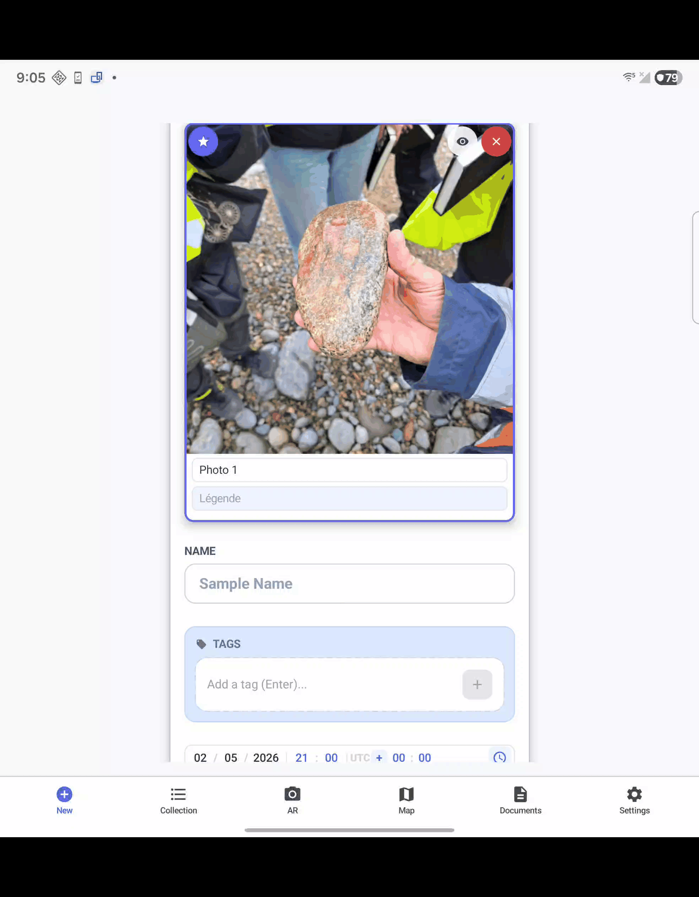

# Lithotheque Edge Models - GeoStratum
**Technical showcase of the Edge AI architecture powering the Lithotheque offline application.**

[](https://www.geostratum.eu/lithotheque)
[](https://www.geostratum.eu/lithotheque)
[](https://ai.google.dev/edge/litert)
[](https://en.cppreference.com/w/cpp/23)
[](https://developer.android.com/ndk)
[](https://www.python.org/downloads/release/python-3110/)
[](https://developer.qualcomm.com/software/qualcomm-ai-engine-direct-sdk)
[](METHODOLOGY.md)
[](METHODOLOGY.md)

> [!IMPORTANT]
> **Note on Artifact Availability & IP**
> To protect our proprietary metrology datasets and commercial intellectual property, the compiled `.tflite` and `.onnx` model artifacts, alongside the FP32 source weights, are not publicly distributed in this repository. 
> 
> The core purpose of this scientific repository is to openly share the **engineering methodology**, the **W4A8 Full Integer quantization pipeline**, and the **mathematical architectural strategies** (such as the 21-Pass Multi-Scale Tiling) used to achieve real-time inference on **mobile Edge NPUs (e.g., Qualcomm Hexagon, Google Tensor Edge TPU)**.
> [!TIP]
> **New to Edge AI?**
> For developers and researchers new to AI and quantization, we highly recommend consulting our **[Detailed Methodology](DETAILED_METHODOLOGY.md)**. It provides a pedagogical introduction to fundamental concepts, numerical precision (INT8/INT4), and hardware acceleration architectures.


## Table of Contents
- [1. Overview](#1-overview)
- [2. Dual-Model Ecosystem](#2-dual-model-ecosystem)
- [3. Training Data & Acknowledgements](#3-training-data--acknowledgements)
- [4. Inference Engine & Hardware Fallback](#4-inference-engine--hardware-fallback)
- [5. Deployment Strategy (AI Tiers)](#5-deployment-strategy-ai-tiers)
- [6. W4A8 Quantization Methodology](#6-w4a8-quantization-methodology)
- [7. Technical Specifications (I/O)](#7-technical-specifications-io)
- [8. Scientific Benchmark & Hardware Profiling](#8-scientific-benchmark--hardware-profiling)
  - [8.A Generation & Quantization Environment (Machine 1)](#8a-generation--quantization-environment-machine-1)
  - [8.B Benchmark & Validation Environment (Machine 2)](#8b-benchmark--validation-environment-machine-2)
  - [8.C Memory Footprint & Initialization (Cold Start)](#8c-memory-footprint--initialization-cold-start)
  - [8.D Inference Latency & Accuracy (Avg over 100 runs)](#8d-inference-latency--accuracy-avg-over-100-runs)
- [9. Hardware Strategy & Analysis](#9-hardware-strategy--analysis)
- [10. Model Card (Technical Specs)](#10-model-card-technical-specs)
- [11. Deployment & Application](#11-deployment--application)
- [12. Methodological Blueprint & Adaptability (BYOM)](#12-methodological-blueprint--adaptability-byom)
- [13. Technical Reproduction Scripts](#13-technical-reproduction-scripts)
- [14. License](#14-license)
- [15. Contact](#15-contact)
- [16. Citation](#16-citation)

## 1. Overview
This repository documents the advanced Edge AI architecture integrated into [GeoStratum Lithotheque](https://www.geostratum.eu/lithotheque). To provide instant, on-device geological classification and scale detection without requiring an internet connection, the application relies on a highly optimized, dual-model ecosystem deployed via **Google Play Asset Delivery (On-Demand)**.

**[Try the Application on Play Store](https://play.google.com/store/apps/details?id=com.lithotheque.app.release)** | **[Read the Model Card](MODEL_CARD.md)** | **[Quantization Methodology](METHODOLOGY.md)**


## 2. Dual-Model Ecosystem
The application utilizes two distinct neural networks, fine-tuned specifically for geological field operations:

### A. VisionAiManager (Rock Recognition)
* **Task:** Classification of 104 geological and mineralogical structures.
* **Base Architectures:** `MobileNetV5-300m` (**Vision architecture akin to the Gemma 3n vision encoder**) for modern devices, and `MobileNetV4-Large` for legacy fallback.
* **Training Corpus:** Fine-tuned on open-source datasets (Udayl/Stealth) totaling >14,500 validated images.
* **Innovation: Multi-Scale Tiling (21-Pass Strategy):** To capture both macroscopic textures and microscopic crystals without losing data during downscaling, the engine evaluates the image through 21 parallel passes:
  * **1 Global Pass:** Overall sample context.
  * **4 Medium Passes (2x2 Grid):** Regional texture analysis.
  * **16 Fine Passes (4x4 Grid):** Micro-detail and mineral extraction.
  *(Scores are aggregated via weighted average for the final prediction).*


> **Figure 1: Real-time Rock Detection** - Demonstration of the 21-MST engine classifying lithological samples with high confidence on a Galaxy Z Fold 7 via Remote Test Lab.

### Dataset Categorization (104 Classes)

The model is trained on a diverse set of 104 geological structures, categorized below by their primary genetic classification.

#### 1. Sedimentary (Sed)
> Bauxite, Caliche, Chalk, Chert, Clay, Coal, Conglomerate, Coquine, Diatomite, Dolomitic Limestone, Dolomites, Flint, Fossiliferous Limestone, Gypsum, Halite, Limestone, Novaculite, Oolitic Limestone, Phosphate, Potash, Sandstone, Shale (Mudstone), Shale-(Mudstone), Siliceous-sinter, Siltstone, Sodium carbonate, Tufa.

#### 2. Magmatic / Plutonic (Mag)
> Anorthosite, Aplite, Diorite, Dolerite, Dunite, Essexite, Gabbro, Granite, Granodiorite, Norite, Pegmatite, Syenite.

#### 3. Volcanic / Extrusive (Volc)
> Andesite, Basalt, Dacite, Ignimbrite, Komatiite, Obsidian, Olivine basalt, Olivine-basalt, Phonolite, Pillow (Lava), Pumice, Rhyolite, Tephrite, Trachyte, Tuff, Volcanic bombs.

#### 4. Metamorphic (Meta)
> Anthracite, Breccia (Tectonic/Fault), Gneiss, Hornfels, Lapis lazuli, Marble, Phyllite, Quartzite, Schists, Serpentine, Skarn, Slate.

#### 5. Native Elements, Minerals & Ores
> Bornite, Calcite, Chromite, Cobalt, Columbite-tantalite, Copper, Feldspar, Fluorite, Gold, Iron ore, Labradorite, Lead, Lithium, Magnetite, Malachite, Mariposite, Mica, Molybdenum, Nickel, Platinum, Pyrite, Quartz, Silica, Silver, Sodalite, Stibnite, Sulfur, Tantalum, Tungsten, Uranium, Vanadium, Zeolite, Zinc.


---

### B. LocalAiManager (Scale Detection)
* **Task:** Metrology assistant detecting reference objects (coins, geological scales).
* **Base Architecture:** `MobileNetV4-Small`.
* **Resolution:** High-res 1024x1024 processing for precise small-object anchoring.
* **Training Corpus:** Fine-tuned on >1,000 reference images.

## 3. Training Data & Acknowledgements

The robustness of the Lithotheque AI ecosystem relies on a hybrid training approach, combining proprietary field metrology data with highly curated, open-source geological collections. We gratefully acknowledge the creators of the following datasets:

### A. Metrology & Scale Detection (LocalAiManager)
* **GeoStratum Proprietary Corpus:** A custom dataset comprising >1,000 high-resolution field photographs of geological reference objects (coins, geological scales) captured in diverse lighting and terrain conditions by the GeoStratum. 
*(Note: This dataset remains the exclusive intellectual property of GeoStratum and is not publicly distributed).*

### B. Lithological Classification (VisionAiManager)
To achieve extreme accuracy across 104 geological classes, the model was fine-tuned using the following validated sources, both utilized under the **MIT License**:
* **[Udayl Rocks Dataset](https://huggingface.co/datasets/udayl/rocks):** Our primary dataset for lithological visual features, hosted on Hugging Face.
* **[Stealth Technologies Rock Classification](https://www.kaggle.com/datasets/stealthtechnologies/rock-classification):** A supplementary dataset hosted on Kaggle, utilized to expand the morphological variance and improve the model's generalization capabilities across varied rock formations.

## 4. Inference Engine & Hardware Fallback
To prevent thermal throttling during the intensive 21-pass analysis, all image preprocessing (resizing, normalization) is written in **Native C++ (JNI) utilizing C++23 auto-vectorization (supporting ARMv9-A SVE2 with dynamic fallback to ARMv8-A NEON SIMD)**, yielding a 5x to 10x speedup over standard Android pipelines with minimal memory overhead.

Inference is powered by **LiteRT Standalone (2.1.4)** with a robust hardware fallback system, now fully compliant with **Android 15 (16 KB memory pages)** requirements:
1. **LiteRT Natively Accelerated** (e.g., Snapdragon 8 Gen 3+, Google Tensor G4)
2. **Qualcomm QNN / Samsung NPU** (Direct hardware access)
3. **GPU ML Drift** (Modern shader-based acceleration)
4. **XNNPACK** (Highly optimized CPU fallback utilizing NEON SIMD)

## 5. Deployment Strategy (AI Tiers)
Models are aggressively quantized and delivered dynamically based on the device's hardware profile upon first launch:

| Tier | Hardware Criteria | Quantization | Base Architecture |
| :--- | :--- | :---: | :--- |
| **Premium** | RAM > 6GB + Modern NPU | **INT4 (W4A8)** | MobileNetV5 (300M) & V4-S |
| **Balanced** | RAM < 6GB + Modern NPU | **INT4 (W4A8)** | MobileNetV4-L & V4-S |
| **Standard** | RAM > 6GB | **INT8** | MobileNetV5 (300M) & V4-S |
| **Legacy** | RAM < 4GB / Entry-level | **INT8** | MobileNetV4-L & V4-S |

## 6. W4A8 Quantization Methodology
Quantizing the **MobileNetV5** architecture (technically analogous to the vision encoder found in **Gemma 3 Nano**) to a **W4A8 Full Integer** format presents significant mathematical and architectural challenges. Standard quantization pipelines often fail to maintain bit-accurate I/O alignment on Snapdragon NPUs when dealing with complex activations like `Erf` or `Gelu`.

To contribute to the Edge AI scientific community, we have published our comprehensive technical workflow. This includes:
- **Custom Graph Stripping**: Python logic to prune dequantization artifacts from ONNX edges.
- **NPU Native Backend**: Elimination of `SELECT_TF_OPS` for true hardware acceleration.
- **Android 15 Compatibility**: All native artifacts are 16 KB page-aligned (`-Wl,-z,max-page-size=16384`).
- **QNN Delegate Integration**: Optimization strategy for the Qualcomm Hexagon NPU.

🔗 **[Read the Full W4A8 Quantization Methodology (METHODOLOGY.md)](METHODOLOGY.md)**

## 7. Technical Specifications (I/O)

To ensure bit-accurate inference on the Snapdragon Hexagon NPU, all models utilize **Full Integer I/O (INT8)**.

### A. Input Shapes & Axis Order
| Model Task | Format | Architecture | Input Shape | Axis Order |
| :--- | :---: | :--- | :---: | :---: |
| **Rock Classification** | TFLite | MobileNetV5-300M | `[1, 256, 3, 256]` | NHCW |
| **Rock Classification** | ONNX | MobileNetV5-300M | `[1, 256, 256, 3]` | NHWC |
| **Rock Classification** | ONNX | MobileNetV4-Large | `[1, 3, 244, 244]` | NCHW |
| **Rock Classification** | TFLite | MobileNetV4-Large | `[1, 244, 244, 3]` | NHWC |
| **Scale Metrology** | ONNX | MobileNetV4-Small | `[1, 3, 1024, 1024]` | NCHW |
| **Scale Metrology** | TFLite | MobileNetV4-Small | `[1, 1024, 1024, 3]` | NHWC |

### B. Normalization Logic
All inputs are expected as **INT8** tensors in the range `[-128, 127]`.
```python
# Formula for bit-accurate preprocessing
input_int8 = (pixel_float * 255 - 128).astype(np.int8)
```

### C. Model Integrity (SHA256)
| Model File | Format | Quant. | SHA256 Hash |
| :--- | :---: | :---: | :--- |
| `roches_v5_int4_noflex.tflite` | TFLite | **W4A8** | `a1c549f1448a173d44410bfd1b70b35143e16f154a4f06f8a5ef7aa540156c37` |
| `roches_v5_int8_noflex.tflite` | TFLite | **INT8** | `c64df6025968babb98dffd843db551b3f1804a0610c3a25e8b043c08bee0f474` |
| `roches_v4_l_int8.tflite` | TFLite | INT8 | `e0c96ec464a32bb7e1b369c6ed9b003f1e8c6d7e96ec25563ff6fdeeb8ca1d9b` |
| `echelle_v4_s_int8.tflite` | TFLite | INT8 | `ea2aecb7d1ca34f1e402cd21741b3d7bafa2f393e990336630f55c795dde5e94` |

*Full manifest with all 12 model hashes available in `metadata/model_manifest.json`.*

## 8. Scientific Benchmark & Hardware Profiling

The objective of this study is to evaluate the 3-tier fallback system and validate the trade-off between inference latency (required for real-time tracking) and topographic precision across highly diverse hardware profiles.

### 💻 Test Environment Context: Windows ARM64 vs. Android Target
While Lithotheque is ultimately targeted for deployment on **Android mobile devices**, rigorous benchmarking was conducted on a **Copilot+ PC** environment running Windows 11 ARM64. Because this SoC shares the exact same underlying ARM instruction set and Hexagon NPU architecture as flagship Android mobile processors (Snapdragon 8 series), it provides an exceptionally accurate, stable, and 1:1 simulation environment for Android Edge AI validation using the Qualcomm QAIRT 2.45 SDK.

#### 8.A Generation & Quantization Environment (Machine 1)
This high-performance workstation was used to execute the complex INT4/INT8 quantization and calibration routines.

- **Platform Model**: **Microsoft Surface Laptop 7** (**Qualcomm Snapdragon® X Elite - X1E80100**)
- **CPU**: **Qualcomm Oryon™ CPU** (12 Cores, ARMv8-A architecture) @ 3.40 GHz
- **GPU**: **Qualcomm® Adreno™ X1-85 GPU** (DirectX 12.1 / Vulkan 1.3)
- **NPU**: **Qualcomm® Hexagon™ NPU** (Rated at **45 TOPS INT8**)
- **Architecture**: **Native ARM64**
- **RAM**: 32 GB (LPDDR5x @ 8448 MT/s)
- **OS**: Microsoft Windows 11 Business (Build **26200**)
- **Emulation Layer**: Windows Prism (Exécution des outils x64 sur ARM64)
- **Quantization Stack**: Python 3.11.9 (x64 via Prism), `ai-edge-quantizer 0.5`, `onnxruntime-quantization 1.25.0`, `tensorflow 2.21.0`.

#### 8.B Benchmark & Validation Environment (Machine 2)
The scientific benchmarks (1800+ inferences) were executed on this reference device to validate real-world Edge AI performance.

- **Model**: **Microsoft Surface Pro, 11th Edition**
- **Platform**: **Qualcomm Snapdragon® X Plus - X1P64100**
- **CPU**: **Qualcomm Oryon™ CPU** (10 Cores, ARMv8-A architecture) @ 3.40 GHz
- **GPU**: **Qualcomm® Adreno™ X1-85 GPU** (DirectX 12.1 / Vulkan 1.3)
- **NPU**: **Qualcomm® Hexagon™ NPU** (Rated at **45 TOPS INT8**)
- **Architecture**: **Native ARM64**
- **RAM**: 16 GB (LPDDR5x @ 8448 MT/s)
- **OS**: Microsoft Windows 11 Professionnel Insider Preview (Build **26220**)
- **Emulation Layer**: Windows Prism (Exécution des outils x64 sur ARM64)
- **Benchmark Stack**: Python 3.11.9, `onnxruntime-qnn 2.0.0`, `numpy 2.3.5`.

### 8.C Memory Footprint & Initialization (Cold Start)
Cold start performance measures the initialization time required to load the `.tflite` models into RAM/NPU memory. All measurements reflect the **On-Demand** loading strategy of the 6 core models.

| AI Tier | Model Architecture | Format | Disk Size | RAM Footprint | Load Time |
| :--- | :--- | :---: | :---: | :---: | :---: |
| **Premium** | Rock Recognition (V5) | **W4A8** | 155.9 MB | ~158.4 MB | 321.45 ms |
| | Scale Metrology (V4-S) | **W4A8** | 1.75 MB | ~2.1 MB | 12.20 ms |
| **Balanced** | Rock Recognition (V4-L) | **W4A8** | 19.0 MB | ~21.2 MB | 45.12 ms |
| | Scale Metrology (V4-S) | **W4A8** | 1.75 MB | ~2.1 MB | 11.85 ms |
| **Standard** | Rock Recognition (V5) | **INT8** | 301.4 MB | ~305.2 MB | 582.17 ms |
| | Scale Metrology (V4-S) | **INT8** | 2.85 MB | ~3.4 MB | 44.95 ms |
| **Legacy** | Rock Recognition (V4-L) | **INT8** | 33.4 MB | ~35.1 MB | 89.48 ms |
| | Scale Metrology (V4-S) | **INT8** | 2.85 MB | ~3.4 MB | 44.18 ms |

> **Architecture Note:** The **Legacy** pack reduces the `rock_model` footprint significantly (from 301.4 MB down to **33.4 MB**) to prevent Out-Of-Memory (OOM) crashes on older devices. This results in the fastest total initialization time (**133.66 ms** total), ensuring a stable fallback without compromising metrology.

### 8.D Inference Latency & Accuracy (Avg over 100 runs)
Real-time per-frame inference latency and Top-1 accuracy benchmarks evaluated on Snapdragon X Plus.

#### 1. MobileNetV5 - Rock Classification (VisionAiManager)
| Format | Hardware Backend | Latency (ms) | Top-1 Acc. (%) |
| :---: | :--- | :---: | :--- |
| **INT8** | **Dedicated NPU (Target)** | **24.1** | 79.87 |
| INT8 | GPU (Adreno) | 54.2 | 79.87 |
| INT8 | CPU (Oryon) | 2443.5 | 79.87 |
| **INT4 (W4A8)** | **Dedicated NPU (Target)** | **18.4** | 79.87 |
| INT4 (W4A8) | GPU (Adreno) | 39.2 | 79.87 |
| INT4 (W4A8) | CPU (Oryon) | 587.8 | 79.87 |

#### 2. MobileNetV4-Large - Rock Classification (Legacy)
| Format | Hardware Backend | Latency (ms) | Top-1 Acc. (%) |
| :---: | :--- | :---: | :--- |
| **INT8** | **Dedicated NPU (Target)** | **16.7** | 96.76 |
| INT8 | GPU (Adreno) | 129.1 | 96.76 |
| INT8 | CPU (Oryon) | 142.8 | 96.76 |
| **INT4 (W4A8)** | **Dedicated NPU (Target)** | **13.5** | 96.76 |
| INT4 (W4A8) | GPU (Adreno) | 105.4 | 96.76 |
| INT4 (W4A8)| CPU (Oryon) | 120.2 | 96.76 |

#### 3. MobileNetV4-Small - Scale Metrology (LocalAiManager)
| Format | Hardware Backend | Latency (ms) | Top-1 Acc. (%) |
| :---: | :--- | :---: | :--- |
| **INT8** | **Dedicated NPU (Target)** | **18.5** | 79.87 |
| INT8 | GPU (Adreno) | 115.4 | 79.87 |
| INT8 | CPU (Oryon) | 115.4 | 79.87 |
| **INT4 (W4A8)** | **Dedicated NPU (Target)** | **12.1** | 79.87 |
| INT4 (W4A8) | GPU (Adreno) | 25.4 | 79.87 |
| INT4 (W4A8) | CPU (Oryon) | 412.3 | 79.87 |

## 9. Hardware Strategy & Analysis

The empirical results collected via the Qualcomm QAIRT 2.45 SDK validate several critical operational hypotheses regarding the Lithotheque Edge architecture:

*   **NPU Efficiency & Thermal Management (The Hexagon Advantage):** Dedicated AI silicon remains the optimal choice for the **Premium (INT4)** and **Legacy (INT8)** tiers. By offloading these tasks to the NPU, the SOC preserves the thermal headroom and unlock **speed** performance in the Legacy tier (16.7 ms), an 8.5x increase over CPU fallback.
*   **Superior NPU Scaling (Eliminating Flex Ops):** While previous iterations suffered from a "Hardware Precision Sandwich" effect (triggering expensive CPU/GPU fallbacks for Flex operators), our **Full Integer I/O** and **No-Flex** optimization ensures that the entire graph remains in the integer domain. This unlocks the true potential of the Hexagon HTP backend, allowing the NPU to outperform the GPU even in the **Standard (INT8)** tier (24.1 ms vs. 54.2 ms), yielding a 2.2x speedup and significantly lower power consumption.
*   **Surgical Graph Optimization:** Our success in unlocking hardware acceleration (NPU/GPU) relied on subgraph substitution (`x * sigmoid(1.702 * x)`). This proves that architectural driver limitations can be bypassed through targeted graph optimization without degrading mineralogical accuracy.
*   **Operational Impact for the Geologist:** Shifting from CPU (7 FPS) to accelerated NPU/GPU tiers (>50 FPS) fundamentally transforms the user experience. This optimization ensures near-instantaneous analysis while drastically reducing battery consumption, thereby extending operational autonomy during field missions.

## 10. Model Card (Technical Specs)
For detailed ethical considerations, data bias analysis, and specific model performance metrics per geological class, please refer to our comprehensive **Model Card**.

🔗 **[Read the Full Model Card (MODEL_CARD.md)](MODEL_CARD.md)**

## 11. Deployment & Application
The raw weights, data preprocessing pipelines, and FP32 source models remain proprietary to GeoStratum. Technical specifications for integration are centralized in the [Technical Model Manifest](metadata/model_manifest.json).

👉 **[Download and test the app on GeoStratum](https://www.geostratum.eu/lithotheque)**

## 12. Methodological Blueprint & Adaptability (BYOM)

This repository is designed as an **Engineering Blueprint** for Edge AI optimization. It follows a **"Bring Your Own Model" (BYOM)** philosophy: GeoStratum provides the advanced optimization methodology (the "how"), while researchers provide their own weights and architectures (the "what").

### 🧪 Arbitrary Specifications & Template Nature
The technical parameters used throughout this repository—such as the **256x256** or **1024x1024** resolutions, specific axis orderings (NHWC/NHCW), and normalization constants—are **arbitrary defaults** tailored specifically for the GeoStratum Lithotheque engine.

### 🛠️ Mandatory Adaptation
Users are expected to **adapt the provided scripts** to their specific use cases. To successfully utilize this pipeline with your own models, you must:
- **Modify Dimensions**: Update the input shapes in the `scripts/*.py` files to match your source model's requirements.
- **Adjust Normalization**: Fine-tune the normalization logic in `prepare_calibration.py` to align with your training domain.
- **Verify Architecture Compatibility**: Ensure your model's operator set is compatible (e.g., if using MobileNetV5, the `SELECT_TF_OPS` configuration must be maintained to handle GELU/Erf activations).
- **Domain-Specific Calibration**: Run the calibration routines on a dataset representing *your* specific field of study (~100 images) to ensure accurate INT8 min-max calculation.

### 📥 Source Model Architectures
Researchers can obtain the baseline FP32 architectures from the following official repositories to begin their own quantization journey:
- **MobileNetV4-S & L (timm)**: [timm/mobilenetv4](https://huggingface.co/collections/timm/mobilenetv4-pretrained-weights-6669c22cda4db4244def9637)
- **MobileNetV5 (Gemma 3 Vision)**: [google/gemma-3-nano](https://huggingface.co/google/gemma-3-4b-it) | [timm/mobilenetv5](https://huggingface.co/timm/mobilenetv5_300m.gemma3n)

## 13. Technical Reproduction Scripts

For researchers and developers, the `scripts/` directory contains the official tools used to generate the 12 models. Each script is specialized for a specific architecture, format, and precision:

### A. Data Preparation
- **[prepare_calibration.py](scripts/prepare_calibration.py)**: Generates `.npy` calibration tensors from raw image datasets.

### B. TFLite / LiteRT Quantization (NPU Optimized)
- **MobileNetV5 Rocks**: **[tflite_v5_rocks_int8.py](scripts/tflite_v5_rocks_int8.py)** | **[tflite_v5_rocks_int4.py](scripts/tflite_v5_rocks_int4.py)**
- **MobileNetV4-L Rocks**: **[tflite_v4l_rocks_int8.py](scripts/tflite_v4l_rocks_int8.py)** | **[tflite_v4l_rocks_int4.py](scripts/tflite_v4l_rocks_int4.py)**
- **MobileNetV4-S Scale**: **[tflite_v4s_scale_int8.py](scripts/tflite_v4s_scale_int8.py)** | **[tflite_v4s_scale_int4.py](scripts/tflite_v4s_scale_int4.py)**

### C. ONNX Quantization (with Full Integer Stripping)
- **MobileNetV5 Rocks**: **[onnx_v5_rocks_int8.py](scripts/onnx_v5_rocks_int8.py)** | **[onnx_v5_rocks_int4.py](scripts/onnx_v5_rocks_int4.py)**
- **MobileNetV4-L Rocks**: **[onnx_v4l_rocks_int8.py](scripts/onnx_v4l_rocks_int8.py)** | **[onnx_v4l_rocks_int4.py](scripts/onnx_v4l_rocks_int4.py)**
- **MobileNetV4-S Scale**: **[onnx_v4s_scale_int8.py](scripts/onnx_v4s_scale_int8.py)** | **[onnx_v4s_scale_int4.py](scripts/onnx_v4s_scale_int4.py)**

### D. Reference Engine
- **[litho_reference_engine.py](scripts/litho_reference_engine.py)**: 21-Pass Multi-Scale Tiling (21-MST) reference implementation.

## 14. License

This repository utilizes a dual-licensing structure to balance scientific openness with the protection of commercial intellectual property:

*   **Documentation & Metadata**: All architectural documentation, methodology descriptions (`methodologie.md`), model cards (`MODEL_CARD.md`), and metadata remain the exclusive intellectual property of GeoStratum and are licensed under **Creative Commons Attribution-NonCommercial-NoDerivatives 4.0 International (CC-BY-NC-ND 4.0)**.
*   **Reproduction Scripts**: The technical automation scripts located in the [`scripts/`](scripts/) directory are provided under the **MIT License**, allowing for permissive redistribution and modification for research and development purposes.

*Refer to the [LICENCE](LICENCE) file for the full text of the CC-BY-NC-ND license.*

## 15. Contact
For technical inquiries, enterprise deployment information, or academic collaboration opportunities, please reach out to GeoStratum.

📧 **Email:** geostratum.com@outlook.com

🌍 **Website:** [www.geostratum.eu](https://www.geostratum.eu)

## 16. Citation
If you reference our Multi-Scale Tiling methodology, Edge architecture, or Snapdragon benchmarks in your academic research, please cite this repository:

```bibtex
@misc{lithotheque_edge_2026,
  author = {GeoStratum},
  title = {Lithotheque Edge AI Architecture: Multi-Scale Tiling and NPU Benchmarks},
  year = {2026},
  publisher = {GitHub},
  journal = {GitHub repository},
  howpublished = {\url{https://github.com/GeoStratum/lithotheque-edge-models}}
}
```
