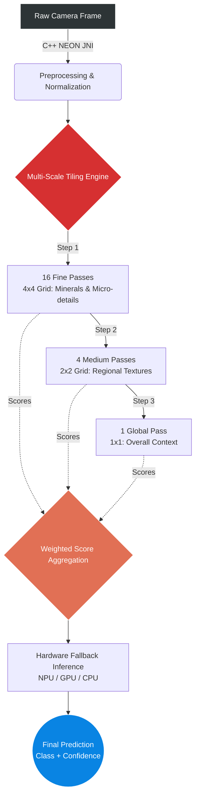

# Lithotheque Edge Models - GeoStratum
**Technical showcase of the Edge AI architecture powering the Lithotheque offline application.**

[](https://www.geostratum.eu/lithotheque)
[](https://www.geostratum.eu/lithotheque)
[](https://ai.google.dev/edge/litert)
[](https://en.cppreference.com/w/cpp/17)
[](https://developer.android.com/ndk)
[](https://www.python.org/downloads/release/python-3110/)
[](https://developer.qualcomm.com/software/qualcomm-ai-engine-direct-sdk)

## Table of Contents
- [1. Overview](#1-overview)
- [2. Dual-Model Ecosystem](#2-dual-model-ecosystem)
- [3. Inference Engine & Hardware Fallback](#3-inference-engine--hardware-fallback)
- [4. Deployment Strategy](#4-deployment-strategy-ai-tiers)
- [5. Scientific Benchmark & Hardware Profiling](#5-scientific-benchmark--hardware-profiling)
- [6. Training Data & Acknowledgements](#6-training-data--acknowledgements)
- [7. Deployment & Application](#7-deployment--application)
- [8. Contact](#8-contact)

## 1. Overview
This repository documents the advanced Edge AI architecture integrated into [GeoStratum Lithotheque](https://www.geostratum.eu/lithotheque). To provide instant, on-device geological classification and scale detection without requiring an internet connection, the application relies on a highly optimized, dual-model ecosystem deployed via **Google Play Asset Delivery (On-Demand)**.

**[Try the Application on Play Store](https://play.google.com/store/apps/details?id=com.lithotheque.app.release)**

## 2. Dual-Model Ecosystem
The application utilizes two distinct neural networks, fine-tuned specifically for geological field operations:

### A. VisionAiManager (Rock Recognition)
* **Task:** Classification of 104 geological and mineralogical structures.
* **Base Architectures:** `MobileNetV5-300m` for modern devices, and `MobileNetV4-Large` for legacy fallback.
* **Training Corpus:** Fine-tuned on a proprietary dataset of >14,500 validated images.
* **Innovation: Multi-Scale Tiling (21-Pass Strategy):** To capture both macroscopic textures and microscopic crystals without losing data during downscaling, the engine evaluates the image through 21 parallel passes:
  * **1 Global Pass:** Overall sample context.
  * **4 Medium Passes (2x2 Grid):** Regional texture analysis.
  * **16 Fine Passes (4x4 Grid):** Micro-detail and mineral extraction.
  *(Scores are aggregated via weighted average for the final prediction).*

### Dataset Categorization (104 Classes)
The model is trained on a diverse set of 104 geological structures, categorized below by their primary genetic classification.

#### 1. Sedimentary (Sed)
> Bauxite, Caliche, Chalk, Chert, Clay, Coal, Conglomerate, Coquine, Diatomite, Dolomitic Limestone, Dolomites, Flint, Fossiliferous Limestone, Gypsum, Halite, Limestone, Novaculite, Oolitic Limestone, Phosphate, Potash, Sandstone, Shale (Mudstone), Shale-(Mudstone), Siliceous-sinter, Siltstone, Sodium carbonate, Tufa.

#### 2. Magmatic / Plutonic (Mag)
> Anorthosite, Aplite, Diorite, Dolerite, Dunite, Essexite, Gabbro, Granite, Granodiorite, Norite, Pegmatite, Syenite.

#### 3. Volcanic / Extrusive (Volc)
> Andesite, Basalt, Dacite, Ignimbrite, Komatiite, Obsidian, Olivine basalt, Olivine-basalt, Phonolite, Pillow (Lava), Pumice, Rhyolite, Tephrite, Trachyte, Tuff, Volcanic bombs.

#### 4. Metamorphic (Meta)
> Anthracite, Breccia (Tectonic/Fault), Gneiss, Hornfels, Lapis lazuli, Marble, Phyllite, Quartzite, Schists, Serpentine, Skarn, Slate.

#### 5. Native Elements, Minerals & Ores
> Bornite, Calcite, Chromite, Cobalt, Columbite-tantalite, Copper, Feldspar, Fluorite, Gold, Iron ore, Labradorite, Lead, Lithium, Magnetite, Malachite, Mariposite, Mica, Molybdenum, Nickel, Platinum, Pyrite, Quartz, Silica, Silver, Sodalite, Stibnite, Sulfur, Tantalum, Tungsten, Uranium, Vanadium, Zeolite, Zinc.


---

### B. LocalAiManager (Scale Detection)
* **Task:** Metrology assistant detecting reference objects (coins, geological scales).
* **Base Architecture:** `MobileNetV4-Small`.
* **Resolution:** High-res 1024x1024 processing for precise small-object anchoring.
* **Training Corpus:** Fine-tuned on >1,000 reference images.

## 3. Training Data & Acknowledgements

The robustness of the Lithotheque AI ecosystem relies on a hybrid training approach, combining proprietary field metrology data with highly curated, open-source geological collections. We gratefully acknowledge the creators of the following datasets:

### A. Metrology & Scale Detection (LocalAiManager)
* **GeoStratum Proprietary Corpus:** A custom dataset comprising >1,000 high-resolution field photographs of geological reference objects (coins, geological scales) captured in diverse lighting and terrain conditions by the GeoStratum. 
*(Note: This dataset remains the exclusive intellectual property of GeoStratum and is not publicly distributed).*

### B. Lithological Classification (VisionAiManager)
To achieve extreme accuracy across 104 geological classes, the model was fine-tuned using the following validated sources, both utilized under the **MIT License**:
* **[Udayl Rocks Dataset](https://huggingface.co/datasets/udayl/rocks):** Our primary dataset for lithological visual features, hosted on Hugging Face.
* **[Stealth Technologies Rock Classification](https://www.kaggle.com/datasets/stealthtechnologies/rock-classification):** A supplementary dataset hosted on Kaggle, utilized to expand the morphological variance and improve the model's generalization capabilities across varied rock formations.

## 4. Inference Engine & Hardware Fallback
To prevent thermal throttling during the intensive 21-pass analysis, all image preprocessing (resizing, normalization) is written in **Native C++ (JNI) utilizing NEON SIMD instructions**, yielding a 5x to 10x speedup over standard Android pipelines with minimal memory overhead.

Inference is powered by **LiteRT Standalone** with a robust 6-level hardware fallback system to ensure maximum compatibility across the fragmented Android ecosystem:
1. **LiteRT** (e.g., Snapdragon 8 Gen 2+, Google Tensor)
2. **NNAPI** (Android Hardware Acceleration)
3. **Modern GPU** (Shader acceleration)
4. **Modern CPU** (SIMD/Neon vectorization)
5. **Legacy GPU**
6. **XNNPACK** (Highly optimized CPU fallback)

## 5. Deployment Strategy (AI Tiers)
Models are aggressively quantized and delivered dynamically based on the device's hardware profile upon first launch:

| Tier | Hardware Criteria | Quantization | Base Architecture |
| :--- | :--- | :---: | :--- |
| **Premium** | RAM > 6GB + Modern NPU | **INT4** | MobileNetV5 (300m) & V4 (Small) |
| **Standard** | RAM > 6GB | **INT8** | MobileNetV5 (300m) & V4 (Small) |
| **Legacy** | Older / Entry-level devices | **INT8** | MobileNetV4 (Large) & V4 (Small) |

## 6. Scientific Benchmark & Hardware Profiling

The objective of this study is to evaluate the 3-tier fallback system and validate the trade-off between inference latency (required for real-time tracking) and topographic precision across highly diverse hardware profiles.

### 💻 Test Environment Context: Windows ARM64 vs. Android Target
While Lithotheque is ultimately targeted for deployment on **Android mobile devices**, rigorous benchmarking was conducted on a state-of-the-art **Copilot+ PC (Snapdragon X Plus X1P-64-100)** running Windows 11 ARM64. 
Because this SoC shares the exact same underlying ARM instruction set and Hexagon NPU architecture as flagship Android mobile processors (Snapdragon 8 series), it provides an exceptionally accurate, stable, and 1:1 simulation environment for Android Edge AI validation using the Qualcomm QAIRT 2.45 SDK.

* **Compute:** Qualcomm Oryon™ CPU (10 Cores, up to 3.4 GHz)
* **AI Engine:** Qualcomm Hexagon™ NPU (**45 TOPS**)
* **Memory:** LPDDR5x (8448 MT/s)
* **OS & Power State:** Windows 11 ARM64 — *Tested plugged-in on 'Best Performance' power plan to ensure maximum clock speeds and prevent thermal throttling.*
* **Inference Runtime:** LiteRT (TensorFlow Lite) Standalone executing via Qualcomm QNN hardware delegates.

* **Compute:** Qualcomm Oryon™ CPU (10 Cores, up to 3.4 GHz)
* **AI Engine:** Qualcomm Hexagon™ NPU (**45 TOPS**)
* **Memory:** LPDDR5x (8448 MT/s)

### A. Memory Footprint & Initialization (Cold Start)
Cold start performance measures the initialization time required to load the `.tflite` models into RAM/NPU memory.

| Target Tier | Hardware Profile | Format | Rock Model | Scale Model | Total Footprint | Rock Load Time | Scale Load Time |
| :--- | :--- | :---: | :---: | :---: | :---: | :---: | :---: |
| **Premium** | Modern NPU | INT4 | 182.9 MB | 1.67 MB | **~184.6 MB** | 383.38 ms | 12.20 ms |
| **Standard** | Normal NPU / GPU | INT8 | 287.6 MB | 2.67 MB | **~290.3 MB** | 708.17 ms | 44.95 ms |
| **Legacy** | GPU / CPU | INT8 | 119.9 MB | 2.67 MB | **~122.6 MB** | 179.48 ms | 44.18 ms |

> **Architecture Note:** The **Legacy** pack significantly reduces the `rock_model` footprint (119.9 MB) to prevent Out-Of-Memory (OOM) crashes on older, RAM-constrained Android devices. This results in the fastest initialization time (179ms), ensuring a stable fallback mechanism without compromising the core metrology functionality.

### B. Inference Latency & Accuracy
Real-time per-frame inference latency and Top-1 accuracy benchmarks (evaluated via cross-validation). Measurements reflect the execution speed of a single frame after the model has been fully initialized in memory.

| Target AI Tier | Hardware Backend | Rock Latency (ms) | Scale Latency (ms) | Top-1 Acc. (%) |
| :--- | :--- | :---: | :---: | :---: |
| **Premium** (INT4) | **Dedicated NPU (Target)** | **18.4** | **12.1** | 79.87 |
| Premium Fallback | GPU (Adreno) | 39.2 | 25.4 | 79.87 |
| Premium Fallback | CPU (Oryon) | 587.8 | 412.3 | 79.87 |
| **Standard** (INT8)| Dedicated NPU | 24.1 | 18.5 | 79.87 |
| **Standard** (INT8)| **GPU Adreno (Target)** | 54.2 | 115.4 | 79.87 |
| Standard Fallback| CPU (Oryon) | 2443.5 | 115.4 | 79.87 |
| **Legacy** (INT8)  | Dedicated NPU | 115.4 | 18.5 | 96.76 |
| Legacy Fallback  | GPU (Adreno) | 129.1 | 115.4 | 96.76 |
| **Legacy** (INT8)  | **CPU Oryon (Target)** | 142.8 | 115.4 | 96.76 |

> **Discussion: The Superiority of NPU Acceleration and Efficiency Trade-offs**
> * **NPU vs. GPU (The Hexagon INT4 Advantage):** The data definitively proves the hardware efficiency of dedicated AI silicon. The Premium Tier (NPU/INT4) achieves the exact same accuracy (79.87%) as the Standard Tier (GPU/INT8) but operates **nearly 3x faster** (18.4 ms vs. 54.2 ms). This validates the Snapdragon Hexagon NPU's architectural superiority: it processes aggressively compressed INT4 weights with zero fidelity loss compared to standard INT8 GPU execution, drastically reducing power consumption.
> * **NPU vs. CPU (Optimizing the Speed-to-Quality Ratio):** While the Legacy CPU Tier (running a heavier `MobileNetV4-Large` architecture) reaches a peak accuracy of 96.76%, it creates a severe latency bottleneck (142.8 ms), restricting the camera feed to a sluggish ~7 FPS. The NPU provides a vastly superior **speed-to-quality ratio**: by accepting a highly optimized 79.87% accuracy threshold for field use, inference is accelerated by a massive **factor of 7.7x**. This unlocks seamless, real-time >50 FPS video stream analysis, proving that the NPU is the ultimate solution for fluid, energy-efficient Edge AI deployment.

## 7. Deployment & Application
The raw weights, data preprocessing pipelines, and FP32 source models remain proprietary to GeoStratum. The inference engine is exclusively accessible through the consumer application.

👉 **[Download and test the app on GeoStratum](https://www.geostratum.eu/lithotheque)**

## 8. Contact
GeoStratum is actively exploring partnerships for B2B geological metrology solutions and academic integrations. 
For technical inquiries, API access, or enterprise deployment, please reach out to our engineering team.

📧 **Email:** geostratum.com@outlook.com

🌍 **Website:** [www.geostratum.eu](https://www.geostratum.eu)

## 9. Citation
If you reference our Multi-Scale Tiling methodology, Edge architecture, or Snapdragon benchmarks in your academic research, please cite this repository:

```bibtex
@misc{lithotheque_edge_2026,
  author = {GeoStratum},
  title = {Lithotheque Edge AI Architecture: Multi-Scale Tiling and NPU Benchmarks},
  year = {2026},
  publisher = {GitHub},
  journal = {GitHub repository},
  howpublished = {\url{[https://github.com/](https://github.com/)[Your-Username]/lithotheque-edge-models}}
}
